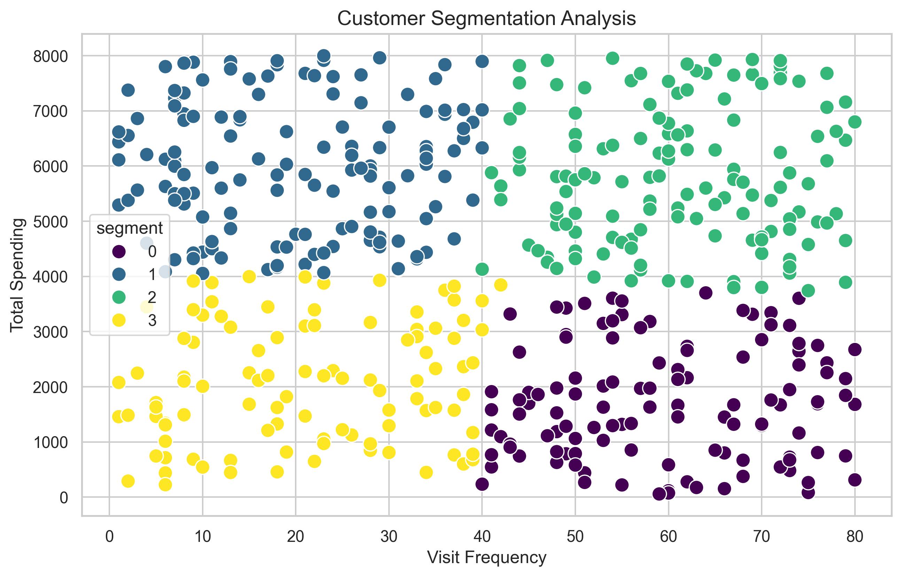
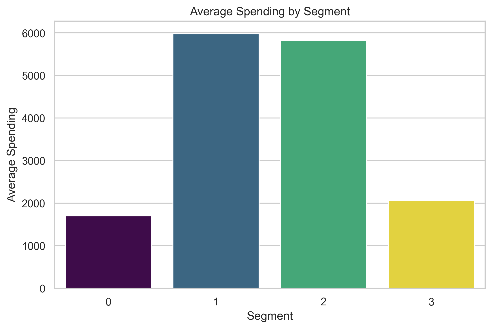
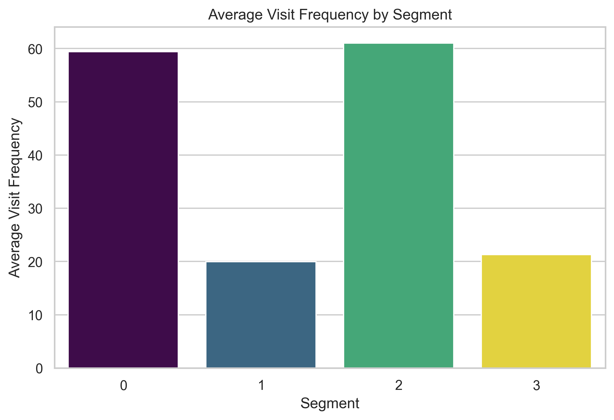

## Customer Segmentation System


---

## Overview

Customer segmentation is a fundamental analytics technique that groups customers according to purchasing behavior, helping businesses improve marketing strategies and customer retention.

This project simulates a complete customer segmentation workflow using Python, SQLite and the K-Means clustering algorithm. Customer data is extracted from a relational database, segmented automatically and exported to an Excel report together with business-oriented visualizations.

---

## Project Objectives

- Extract customer data from a SQLite database.
- Prepare and preprocess customer information for clustering.
- Apply the K-Means algorithm to identify customer segments.
- Analyze the characteristics of each customer group.
- Generate business-friendly customer profiles.
- Export results to a professional Excel report.
- Visualize customer segments through informative charts.

---

## Project Structure

```text
customer-segmentation-system/
│
├── data/
│   └── customer_data.db
│
├── images/
│   ├── customer_clusters.png
│   ├── average_spending_by_segment.png
│   └── average_visit_frequency_by_segment.png
│
├── results/
│   └── customer_segmentation_report.xlsx
│
├── src/
│   └── customer_segmentation.py
│
├── README.md
├── requirements.txt
└── .gitignore
```

---

## Dataset

The project uses a simulated customer database stored in **SQLite**.

Each customer record contains:

| Feature | Description |
|----------|-------------|
| Customer ID | Unique customer identifier |
| Customer Name | Customer name |
| Total Spending | Total amount spent by the customer |
| Visit Frequency | Number of customer visits |
| Days Since Last Purchase | Days elapsed since the most recent purchase |

---

## Technologies Used

| Technology | Purpose |
|------------|---------|
| Python | Data analysis and machine learning |
| Pandas | Data manipulation |
| SQLite | Database storage |
| Scikit-Learn | K-Means clustering |
| Matplotlib | Data visualization |
| Seaborn | Statistical visualization |
| OpenPyXL | Excel report generation |

---

## Methodology

### 1. Data Extraction

Customer information is retrieved directly from a SQLite relational database using SQL queries.

The extracted dataset includes spending history and purchasing activity for every customer.

---

### 2. Data Preprocessing

Before clustering, the dataset is cleaned and prepared for analysis.

The preprocessing stage includes:

- Loading customer data into a Pandas DataFrame.
- Selecting numerical variables relevant for clustering.
- Preparing the feature matrix for the K-Means algorithm.

---

### 3. Customer Segmentation

Customer groups are identified using the **K-Means clustering algorithm**.

K-Means groups customers according to similarities in their purchasing behavior by minimizing the distance to each cluster centroid.

Each customer receives a segment label representing the cluster to which they belong.

---

### 4. Cluster Analysis

Once segmentation is complete, summary statistics are calculated for each cluster.

The analysis includes:

- Average customer spending
- Average visit frequency

These metrics provide a clear understanding of the characteristics that define each customer segment.

---

### 5. Business Interpretation

Raw cluster numbers are automatically translated into business-friendly customer profiles.

Examples include:

- High-value frequent customers
- Premium occasional customers
- Frequent low-spending customers
- Low-value occasional customers

This interpretation makes the results easier to understand for non-technical stakeholders and supports business decision-making.

---

### 6. Results Export

The complete analysis is exported to an Excel workbook containing three worksheets:

- **Customer List**
- **Cluster Summary**
- **Segment Interpretation**

This report provides both detailed customer information and summarized business insights.

---

### 7. Data Visualization

The project generates several visualizations to support exploratory analysis and business interpretation.

The generated charts include:

- Customer clusters
- Average spending by segment
- Average visit frequency by segment

These visualizations facilitate comparison between customer groups and help identify valuable business patterns.

---

## Results

## Customer Segmentation

The scatter plot below illustrates how customers are distributed across the different clusters identified by the K-Means algorithm.

Each color represents a unique customer segment with similar purchasing behavior.

<p align="center">

</p>

---

### Average Spending by Segment

This chart compares the average spending of customers within each segment.

It provides a quick overview of which groups generate the highest revenue and helps identify premium customer segments.

<p align="center">

</p>

---

### Average Visit Frequency by Segment

This visualization compares the average number of visits made by customers in each segment.

Combined with spending information, it offers valuable insights into customer loyalty and purchasing habits.

<p align="center">

</p>

---

## Business Insights

The segmentation reveals distinct customer profiles with different purchasing behaviors.

Some customer groups spend significantly more than others despite visiting less frequently, while other groups make regular purchases but contribute lower overall revenue.

These insights can support various business strategies, including:

- Personalized marketing campaigns.
- Customer retention initiatives.
- Loyalty program optimization.
- Targeted promotional offers.
- Resource allocation based on customer value.

Although the dataset is simulated, the workflow closely resembles customer segmentation processes commonly used in retail, e-commerce, and CRM analytics.

---

## Excel Report

The project automatically generates an Excel report containing three worksheets.

#### Customer List

Contains every customer together with the segment assigned by the K-Means model.

#### Cluster Summary

Provides average spending and average visit frequency for each customer segment.

#### Segment Interpretation

Translates each numerical cluster into a business-friendly customer profile, making the results easier to understand for non-technical stakeholders.

---

## How to Run

Clone the repository:

```bash
git clone https://github.com/mauriciocasanovas/customer-segmentation-system.git
```

Navigate to the project directory:

```bash
cd customer-segmentation-system
```

Install the required dependencies:

```bash
pip install -r requirements.txt
```

Run the project:

```bash
python src/customer_segmentation.py
```

After execution, the project automatically:

- Connects to the SQLite database.
- Loads customer information.
- Performs customer segmentation.
- Generates three visualizations.
- Creates the Excel report containing the segmentation results.

---

## 👨‍💻 Author

**Mauricio Javier Casanovas Juárez**

GitHub: https://github.com/mauriciocasanovas

---